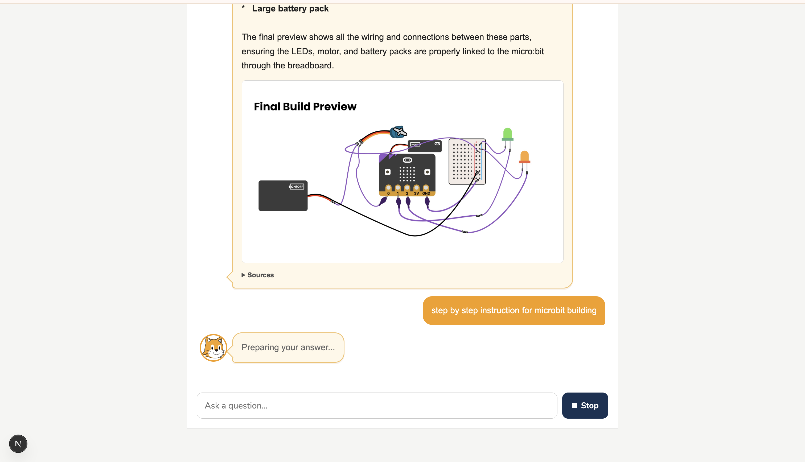
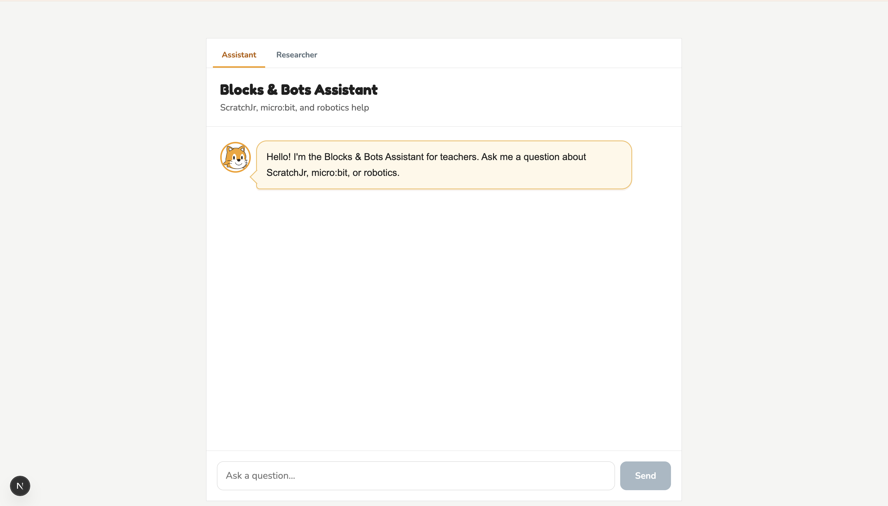
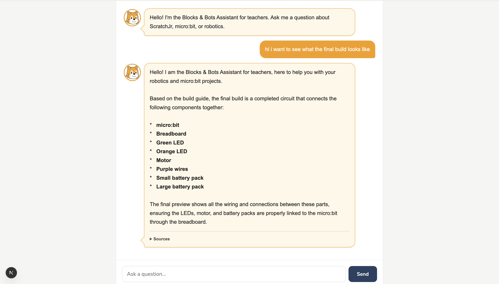
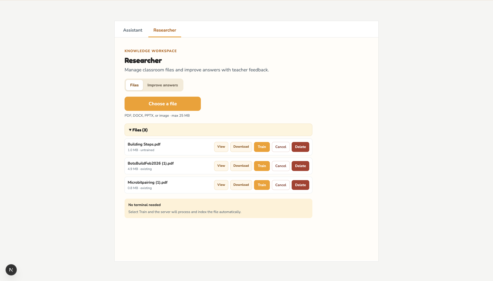
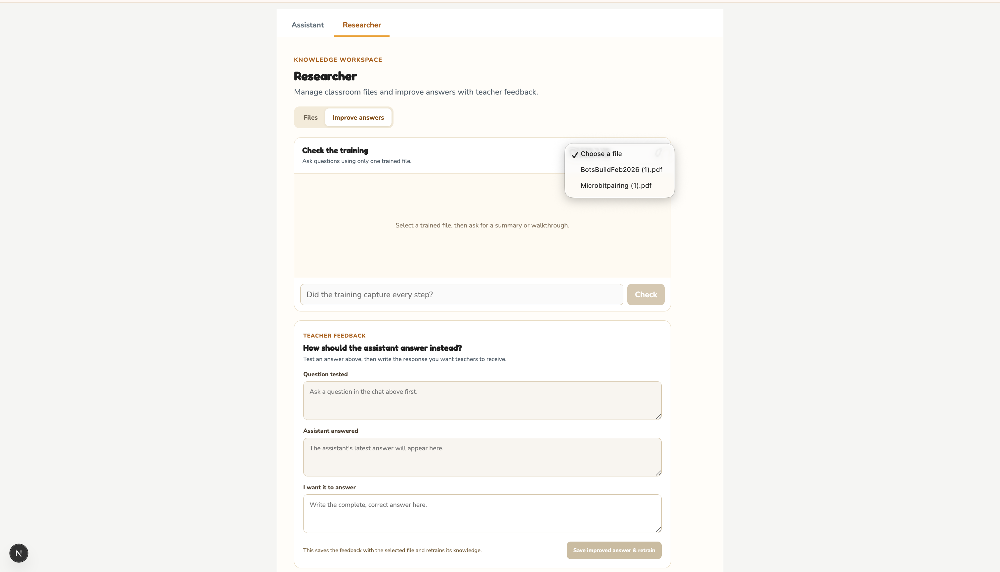

# Blocks & Bots AI Assistant

A multimodal, retrieval-augmented AI assistant that helps educators navigate ScratchJr, micro:bit, and classroom robotics materials.

It retrieves grounded answers from curriculum documents, returns relevant instructional images, and includes a researcher workspace for document ingestion, testing, and expert feedback.

<p align="center">
  
</p>

<p align="center">
  <strong>Next.js · TypeScript · Gemini · Supabase · Hugging Face Transformers · RAG</strong>
</p>

---

## Overview

Teachers working with ScratchJr, micro:bit, and robotics often need to search across lesson plans, build guides, pairing instructions, and troubleshooting documents while supporting students.

Blocks & Bots AI Assistant turns those materials into a conversational knowledge system.

Users can ask questions such as:

- “How do I pair a micro:bit?”
- “Show me the final robot build.”
- “Give me the complete building instructions.”
- “What happens in Step 4?”
- “Show me the diagram for this step.”

The assistant retrieves relevant curriculum content, generates a grounded response, and returns matching images and source information.

---

## Demo

- **Live Demo:** Coming soon
- **Video Walkthrough:** Coming soon

### Teacher Assistant

<p align="center">
  
</p>

### Grounded Answers with Sources

<p align="center">
  
</p>

### Visual Retrieval

<p align="center">
  
</p>

---

## Key Features

### Teacher Experience

- Answers questions about ScratchJr, micro:bit, and robotics
- Retrieves information from approved curriculum documents
- Supports follow-up questions using recent conversation history
- Recognizes lesson numbers, build steps, pairing questions, and visual requests
- Returns relevant instructional images with generated answers
- Includes source file, page, slide, and section metadata
- Handles ambiguous step requests across multiple documents
- Generates complete step-by-step walkthroughs
- Allows users to stop an in-progress request

### Researcher Experience

- Upload PDF, DOCX, PPTX, and image files
- Process and index classroom materials from the browser
- Train or untrain individual files
- Preview, download, and permanently delete resources
- Test the assistant against one selected document
- Compare generated answers with educator-approved responses
- Save corrected answers back into the retrieval knowledge base

---

## Researcher Workspace

The researcher workspace allows curriculum maintainers to manage knowledge sources without editing code or manually running ingestion scripts.

### File Management

<p align="center">
  
</p>

Researchers can upload, preview, download, index, untrain, and delete individual classroom resources.

### Human-in-the-Loop Feedback

<p align="center">
  
</p>

Researchers can:

1. Select a trained document
2. Ask a test question
3. Review the assistant’s answer
4. Write an improved response
5. Re-index the correction into the knowledge base

This workflow improves future retrieval without fine-tuning the underlying Gemini model.

---

## How It Works

```text
Curriculum Documents
        |
        v
Text and Image Extraction
        |
        v
Chunking and Metadata Generation
        |
        v
Hugging Face Embeddings
        |
        v
Supabase Vector Search
        |
        v
Intent and Context-Aware Retrieval
        |
        v
Google Gemini
        |
        v
Grounded Answer + Sources + Images
