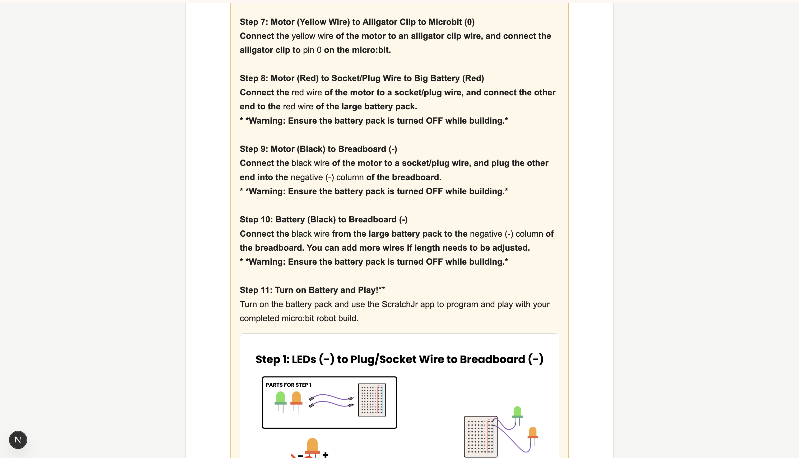

# Blocks & Bots AI Assistant

A retrieval-augmented AI assistant that helps teachers navigate ScratchJr, micro:bit, and classroom robotics resources.

The assistant searches approved curriculum documents, retrieves relevant instructions and visuals, and generates grounded answers with source references.

It also includes a researcher workspace for uploading classroom materials, managing indexed files, testing responses, and improving the assistant through teacher feedback.

<p align="center">
  
</p>

---

## Demo

<!-- Replace these placeholders when the links are ready -->

- **Live Demo:** Coming soon
- **Video Walkthrough:** Coming soon

### Grounded Question Answering

The assistant retrieves information from curriculum documents and generates answers grounded in the uploaded materials.

<p align="center">
  
</p>

### Visual Retrieval

When a question requires a diagram or instructional image, the assistant returns the relevant visual alongside the generated response.

<p align="center">
  
</p>

### Step-by-Step Instructions

The assistant can retrieve complete build instructions while preserving step order, safety warnings, and related diagrams.

<p align="center">
  
</p>

---

## Why I Built This

Teachers working with ScratchJr, micro:bit, and classroom robotics often need to search across lesson plans, setup guides, troubleshooting documents, and build instructions while helping students.

This project turns those materials into a searchable conversational assistant.

Instead of manually opening multiple files, teachers can ask questions such as:

- How do I pair a micro:bit?
- What does this ScratchJr block do?
- Show me the final robotics build.
- Give me the complete step-by-step build instructions.
- Show me the diagram for Step 4.
- What should I check when the robot does not move?

The system retrieves relevant curriculum content, preserves document metadata, and produces an answer with supporting sources and visuals.

---

## Key Features

### Teacher Assistant

- Answers questions about ScratchJr, micro:bit, and classroom robotics
- Searches across approved curriculum documents
- Supports multi-turn follow-up questions
- Detects lesson, build-step, pairing, and visual requests
- Retrieves relevant instructional diagrams and images
- Returns source file, page, slide, and section information
- Handles ambiguous step requests across multiple documents
- Generates complete step-by-step guides
- Allows users to stop an in-progress request

### Researcher Workspace

- Upload PDF, DOCX, PPTX, and image files
- Process and index classroom materials from the browser
- Train or untrain individual files
- Preview and download uploaded resources
- Permanently delete files and associated generated data
- Test the assistant using one selected document
- Compare generated responses with teacher-approved answers
- Save corrected answers back into the retrieval knowledge base

---

## Researcher File Management

Researchers can manage classroom resources without running ingestion commands manually.

<p align="center">
  
</p>

Uploaded files can be individually trained, removed from retrieval, downloaded, previewed, or permanently deleted.

---

## Human-in-the-Loop Improvement

Researchers can select a trained file, test the assistant with a question, review its answer, and write the response they want teachers to receive.

<p align="center">
  
</p>

The tested question, generated answer, and teacher-provided correction are stored together. The improved answer is then re-indexed into the retrieval knowledge base.

This does not fine-tune the Gemini model itself. It improves future retrieval by adding expert-reviewed knowledge to the indexed document collection.

---

## System Architecture

```text
Teacher or Researcher
          |
          v
Next.js + React Interface
          |
          v
Next.js Route Handlers
          |
          +-----------------------------+
          |                             |
          v                             v
Intent and Context Parsing      Researcher File APIs
          |                             |
          v                             v
Query Embedding                 Document Ingestion
Hugging Face gte-small          Text and Image Extraction
          |                             |
          +--------------+--------------+
                         |
                         v
              Supabase PostgreSQL
              Vector Similarity Search
                         |
                         v
             Retrieved Text + Metadata
                  + Relevant Images
                         |
                         v
              Google Gemini 2.5 Flash
                         |
                         v
          Grounded Answer + Sources
